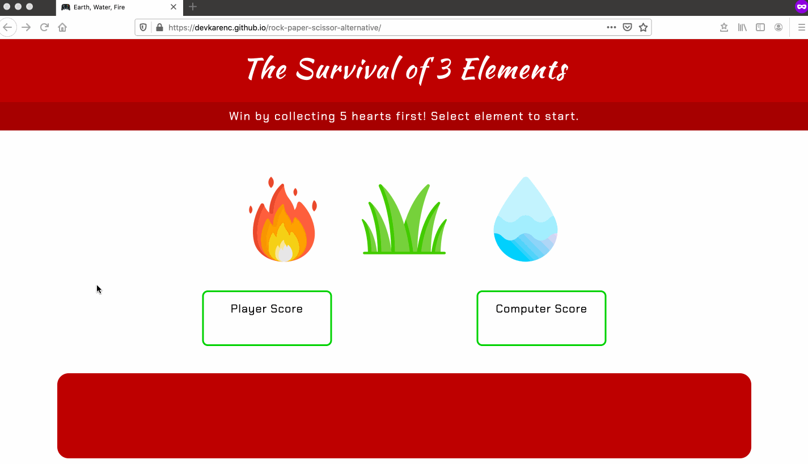

## Rock, Paper, Scissors: the Alternative

This game was inspired by the classic game of Rock, Paper, Scissors. You can relive your childhood instead with the 3 elements: fire, earth, or water. The rules are simple: fire beats earth, earth beats water, and water beats fire.

A player can start the game by clicking on any of the elements. If the player wins a round, a heart appears in the player's score box. If the opponent (randomized computer choice) wins, a heart appears in the computer's score box instead. If it's a tie, a corresponding message is displayed in the message box and the game proceeds to the next round. The game ends when either the player or the computer wins by collecting 5 hearts first. If the player wishes to play another game, they can simply click on the _Play Again_ button.

Test your luck by playing the game <a href="https://devkarenc.github.io/rock-paper-scissor-alternative/" target="_blank">here</a> and have fun!

---

### Demo Game Play

---

Thanks to The Odin Project for providing an idea and guidance for this project! 🎊
